# RAG

This document provides an overview of Retrieval-Augmented Generation (RAG) systems, serving as a reference for key concepts and considerations for: architecture, data ingestion strategies, retrieval techniques, context relevance filtering, generation methods, evaluation measures, security concerns, and tools/frameworks in the RAG ecosystem.

- [RAG](#rag)
  - [Purpose of RAG](#purpose-of-rag)
  - [RAG Terminology](#rag-terminology)
  - [Architecture](#architecture)
  - [Retrieval](#retrieval)
    - [Corpus Ingestion](#corpus-ingestion)
      - [Preprocessing](#preprocessing)
      - [Engineering considerations](#engineering-considerations)
      - [Chunking](#chunking)
      - [Embeddings](#embeddings)
      - [Metadata](#metadata)
    - [Retriever](#retriever)
    - [Context Relevance Filtering](#context-relevance-filtering)
  - [Generation](#generation)
  - [Evaluation](#evaluation)
  - [Business considerations](#business-considerations)
  - [Security Concerns](#security-concerns)
  - [RAG Tools and Frameworks](#rag-tools-and-frameworks)

## Purpose of RAG

At its core, RAG is a relatively simple concept: a user asks a question, the system retrieves relevant information from a document corpus, and a Large Language Model (LLM) uses that retrieved context to generate the final response. Different RAG architectures vary in how retrieval is performed and how the LLM uses retrieved evidence.

As the name suggests (**Retrieval**-Augmented Generation), RAG is most useful when you have a large corpus and need answers grounded in source material. By conditioning generation on retrieved evidence, RAG can improve response accuracy and relevance compared with relying only on the model's internal knowledge, which may be outdated or incomplete.

If the corpus is small enough to fit directly in the model's context window, or if your use case does not require evidence-grounded responses, RAG may not be necessary. In those cases, a traditional LLM workflow can be simpler and sufficient.

## RAG Terminology

- Grounding / Faithfulness: ensuring model responses are supported by retrieved evidence rather than invented.
- Corpus: the collection of documents, passages, or knowledge sources used for retrieval.
- Chunking: splitting documents into smaller units (chunks) for indexing and retrieval.
- Embeddings: dense vector representations of text used to measure semantic similarity.
- Vector store: embedding database used for semantic similarity search.
- Dense retrieval: retrieval based on embedding similarity.
- Sparse retrieval: keyword or lexical retrieval (e.g., BM25).
- Hybrid search: combining dense and sparse retrieval for better recall and precision.
- Retriever: the component that finds relevant documents or passages from the indexed corpus.
- Re-ranker (reranking): a second-stage model that reorders retrieved results by relevance.
- Top-K retrieval: selecting the K highest-ranked chunks/documents for downstream use.
- Approximate nearest neighbor (ANN): fast similarity search method used in vector databases.
- Semantic search: retrieval based on meaning rather than exact keyword matching.
- Metadata filtering: restricting retrieval by fields like source, date, author, or document type.
- Query rewriting / expansion: reformulating the user query to improve retrieval effectiveness.
- Context window: the token limit for the model to process prompt plus retrieved content.
- Context packing: selecting and ordering retrieved chunks to maximize useful context in the prompt.
- Source attribution / citation: linking model output to specific retrieved documents or passages.
- Hallucination: generation of unsupported or incorrect information by the model.
- Multi-hop retrieval: using sequential retrieval steps to answer complex questions.
- Relevance scoring: ranking retrieved items by how well they match the query.
- Retrieval latency: time taken to fetch and return relevant context for the model.
- Prompt injection: malicious or irrelevant information introduced through retrieved context.

## Architecture

A RAG system is generally made up of two main components: the first being a retriever which searches a corpus of documents for relevant information based upon similarity to the query, and the second being a generator (LLM) which takes the retrieved information with the original query and produces a final answer.

**Vector search**: The foundational and most widely deployed RAG pattern. At ingestion time, documents are split into chunks, and each chunk is passed through an embedding model to produce a dense vector that encodes semantic meaning. These vectors are stored in a vector database alongside the original text and any associated metadata. At query time, the same embedding model converts the user's query into a vector, and an approximate nearest-neighbour (ANN) search algorithm — such as HNSW or IVF — retrieves the top-K chunks whose vectors are closest in the high-dimensional embedding space. The retrieved chunks are then concatenated into the prompt context passed to the LLM alongside the original query, and the LLM generates a grounded response based on that evidence.

The key design decisions in a vector search RAG system are the choice of embedding model (which determines what "similarity" means), the chunking strategy (which controls how much context each retrieved unit carries), and the index configuration (which governs the trade-off between retrieval speed and recall accuracy).

**Strengths:**

*Technical:*

- **Semantic understanding**: Captures meaning and context rather than just keyword matching, enabling retrieval of semantically similar content even with different wording
- **Scalability**: Efficient nearest-neighbor search algorithms (HNSW, IVF) allow fast retrieval from large corpora (millions of documents)
- **Language agnostic**: Multilingual embeddings enable cross-language semantic search
- **Low latency retrieval**: Fast query-to-vector conversion allows sub-second response times
- **Relatively simple implementation**: Well-established tooling and frameworks (Pinecone, Weaviate, Milvus, FAISS)
- **Memory efficiency**: Dense embeddings use less storage than maintaining full text indexes

*Business:*

- **Cost-effective at scale**: Embedding models are relatively inexpensive to run; retrieval is computationally light compared to alternatives
- **Vendor independence**: Open-source models and vector DBs allow flexibility in technology choices

**Weaknesses:**

*Technical:*

- **Embedding representation loss**: Converting documents to fixed-size vectors loses fine-grained information; similar embeddings don't guarantee semantic relevance
- **Curse of dimensionality**: High-dimensional spaces create sparsity challenges; relevance scoring becomes less meaningful with many dimensions
- **Query-document mismatch**: Query embeddings may not match document embeddings well if trained on different data distributions
- **Out-of-domain performance degradation**: Embeddings trained on general data perform poorly on specialized domains without fine-tuning
- **Limited reasoning capability**: Vector search cannot handle complex logical queries or multi-hop reasoning effectively
- **Semantic ambiguity**: Words with multiple meanings may embed similarly despite different contexts
- **Cold-start problem**: New documents or users lack embedding context until indexed
- **Irrelevant context in edge cases**: Semantic similarity can retrieve contextually irrelevant content that happens to be embeddings-similar (e.g., homonyms)
- **No explicit entity/relationship understanding**: Requires hybrid approaches to capture structured knowledge effectively

*Business:*

- **Hallucination risk**: Irrelevant retrieved context can still mislead LLMs into generating false information
- **Increased latency vs. traditional search**: Embedding computation and nearest-neighbor search slower than exact keyword matching
- **Infrastructure complexity**: Requires maintaining separate vector databases, embedding services, and additional infrastructure
- **Embedding model dependency**: Quality tied to embedding model choice; model updates require re-indexing entire corpus (expensive at scale)
- **Black-box retrieval**: Difficult to explain why specific documents were retrieved; challenging for regulated industries requiring transparency
- **Scalability costs**: Storage and query costs increase with corpus size; can become expensive for very large datasets
- **Integration complexity**: Requires coordination between embedding service, vector DB, and LLM; multiple failure points

**Memory RAG**: Extends traditional vector search by adding a persistent memory layer that accumulates knowledge from past interactions. Memory is typically structured across multiple tiers: short-term or session memory holds the recent conversation history and retrieved context for the current interaction; long-term memory stores distilled facts, user preferences, or summaries of past sessions across many interactions.

At query time, the retriever pulls from both the main document corpus and the memory store. Retrieved memory entries are injected into the prompt alongside standard document context, allowing the LLM to reason over what it already knows about the user or topic. A memory management process runs alongside the main flow to decide what to write to memory, what to update, and what to evict — often using importance scoring, recency weighting, or explicit LLM-driven summarization.

This architecture is commonly used in long-lived assistant scenarios such as enterprise copilots, personal productivity tools, and customer support systems where users return repeatedly and benefit from continuity.

**Strengths:**

*Technical:*

- **Session continuity**: Preserves relevant prior interactions, improving follow-up retrieval and reducing loss of context across turns
- **Personalization**: Retrieval can incorporate user-specific preferences, history, and working context
- **Adaptive relevance**: The system can prioritize information that has proven useful in earlier interactions
- **Reduced repetition**: Avoids repeatedly retrieving or re-explaining the same context in ongoing workflows

*Business:*

- **Higher user stickiness**: Better continuity and personalization make the system more useful for repeat users
- **Stronger workflow support**: Well suited to copilots, assistants, and enterprise tools used over extended sessions
- **Potential cost savings in recurring tasks**: Reused memory can reduce redundant retrieval and repeated prompt construction

**Weaknesses:**

*Technical:*

- **Memory pollution**: Low-quality or outdated memories can compound over time and degrade retrieval quality
- **State management complexity**: Requires logic for what to store, update, forget, or prioritize
- **Conflict resolution**: The system must handle contradictions between stored memory, retrieved documents, and current user intent
- **Staleness risk**: Persisted memory may remain influential after the source facts or user needs have changed

*Business:*

- **Privacy and retention concerns**: Persistent user memory increases governance and compliance requirements
- **Higher implementation complexity**: Durable memory adds product and platform complexity beyond a stateless RAG flow
- **Trust sensitivity**: Users may lose confidence quickly if the system remembers incorrect or unwanted information

**Hybrid RAG (Knowledge graphs)**: Augments vector similarity search with a structured knowledge graph (KG) that represents entities, their properties, and the relationships between them. The KG is typically constructed during ingestion using an entity and relation extraction pipeline — often LLM-assisted — which identifies named entities (people, organisations, products, concepts) and the typed edges connecting them, then stores them in a graph database such as Neo4j.

At query time, two retrieval paths run in parallel or in sequence. The vector path performs standard semantic search over chunked documents to retrieve relevant passages. The graph path parses the query for entity mentions, traverses the knowledge graph to find related entities and relationships, and returns structured facts or sub-graphs as additional context. The results from both paths are merged — usually by a ranker or fusion layer — before being passed to the LLM.

This dual-path approach enables the LLM to answer questions that require relational reasoning ("who reports to whom", "which components depend on this module") or multi-hop inference ("find all customers who purchased product X which was manufactured by supplier Y") that vector similarity alone cannot reliably support.

**Strengths:**

*Technical:*

- **Combines semantic and symbolic retrieval**: Uses vector similarity for broad recall and graphs for precise entity and relationship traversal
- **Better multi-hop reasoning support**: Graph structure helps answer questions that depend on linked facts across documents
- **Improved precision for structured queries**: Effective when users ask about relationships, hierarchies, dependencies, or lineage
- **Explainable retrieval paths**: Graph edges can provide a clearer rationale for why information was selected

*Business:*

- **Strong fit for enterprise knowledge domains**: Useful for legal, financial, engineering, and operational data with explicit relationships
- **Better support for high-stakes queries**: More structured retrieval can reduce errors in domains where precision matters
- **Improved auditability**: Graph-backed answers can be easier to justify to stakeholders than embedding-only retrieval

**Weaknesses:**

*Technical:*

- **Graph construction overhead**: Building and maintaining entities, relations, and schemas is significantly more complex than chunking text
- **Schema rigidity**: Changes in domain concepts or source structure can require expensive schema and pipeline updates
- **Knowledge extraction bottleneck**: Poor entity extraction or relationship linking directly harms graph usefulness
- **Dual-system complexity**: Coordinating graph retrieval with vector retrieval increases orchestration and tuning complexity

*Business:*

- **High upfront investment**: Requires more domain modeling, data engineering, and governance work before value is realized
- **Slower time-to-value**: Deployment timelines are longer than simpler vector-only systems
- **Specialist dependency**: Often needs domain experts to define schemas and validate graph quality

**Hypothetical Document Embeddings (HyDE)**: Addresses a core mismatch in standard vector search — the fact that a short, terse user query often embeds very differently from the longer, richer document passages that contain the answer. HyDE resolves this by shifting the embedding from the raw query to a synthetic, hypothetical document.

At query time, the LLM is given the user's question and asked to generate a plausible answer as if it were a passage from a relevant document — without access to the actual corpus. This hypothetical document is then embedded and used as the search vector to retrieve real corpus chunks. Because the hypothetical document is written in the same style, length, and vocabulary as the documents in the index, its embedding is more likely to be geometrically close to the embeddings of genuinely relevant chunks than the short query embedding would be.

The retrieved real documents are then passed — along with the original query — to the LLM to generate the final grounded answer. The hypothetical document itself is discarded and never shown to the user. HyDE works best in domains where users phrase questions tersely but the corpus uses expository prose, such as technical documentation, academic literature, or legal texts.

**Strengths:**

*Technical:*

- **Bridges vocabulary mismatch**: Generated hypothetical passages can better match the language likely to appear in relevant documents
- **Improves recall for vague queries**: Helpful when user questions are underspecified or use sparse keywords
- **Works without corpus-specific retriever training**: Can improve retrieval quality without rebuilding the underlying index design
- **Useful in zero-shot settings**: Effective when the system must support broad query styles without extensive tuning

*Business:*

- **Better query coverage**: Can improve performance for non-expert users who ask imprecise or poorly phrased questions
- **Lower replatforming cost**: Retrieval quality can improve without replacing the existing corpus or vector database
- **Faster experimentation**: Teams can test retrieval improvements at query time rather than redesign ingestion first

**Weaknesses:**

*Technical:*

- **Hypothetical drift**: The generated document may emphasize plausible but incorrect details, steering retrieval away from the right evidence
- **Extra query-time latency**: Each search requires an additional generation step before retrieval
- **Model sensitivity**: Retrieval quality depends heavily on the prompt and model used to generate the hypothetical document
- **Brittle for exact-match needs**: Can underperform on queries that require precise identifiers, codes, or wording

*Business:*

- **Higher per-query cost**: Additional LLM calls increase operating cost relative to direct retrieval
- **Less predictable ROI**: Gains may be strong for some query classes and weak for others
- **Harder to validate**: Teams must evaluate both retrieval quality and the quality of the hypothetical query expansion

**Corrective RAG (CRAG)**: Introduces a self-evaluation step between retrieval and generation that assesses the quality of retrieved documents before they are used to produce an answer. Rather than blindly passing top-K chunks to the LLM, CRAG uses a lightweight evaluator — typically a prompted LLM or fine-tuned classifier — to score each retrieved document for relevance to the query.

Based on the scores, the system takes one of three paths. If retrieved documents are judged highly relevant, they are passed directly to the generator. If documents are partially relevant, a knowledge refinement step extracts only the most pertinent sentences or sub-sections before generation. If all retrieved documents are judged irrelevant or the corpus appears insufficient, the system triggers a fallback strategy — commonly web search or an alternative retrieval source — to obtain better evidence before proceeding.

This corrective loop means the generator only ever receives evidence that has passed a minimum quality threshold, significantly reducing the risk of confidently wrong answers caused by irrelevant context being included in the prompt. CRAG is particularly effective for open-domain questions where the indexed corpus may have uneven coverage.

**Strengths:**

*Technical:*

- **Recovery from poor first-pass retrieval**: Can detect weak evidence and trigger another retrieval attempt
- **Improved robustness**: Better handles ambiguous, noisy, or difficult queries than single-pass retrieval
- **Dynamic retrieval strategy**: The system can change search behavior based on the quality of intermediate results
- **Reduced silent failure**: More likely to surface when the initial context is insufficient rather than proceeding blindly

*Business:*

- **Higher answer quality on long-tail questions**: Useful where query difficulty is uneven and first-pass retrieval is often unreliable
- **Better resilience in production**: Iterative correction can reduce visible failures for complex user requests
- **Potential quality differentiation**: Can outperform simpler RAG systems in premium or expert-facing use cases

**Weaknesses:**

*Technical:*

- **Higher latency**: Multiple retrieval and evaluation passes increase end-to-end response time
- **More orchestration complexity**: Requires control logic for when to retry, how to correct, and when to stop
- **Error amplification risk**: Weak self-critique or incorrect correction signals can send retrieval further off course
- **Harder evaluation**: More moving parts make it difficult to isolate where failures originate

*Business:*

- **Higher inference cost**: Additional retrieval and model steps materially increase serving cost
- **Less predictable SLAs**: Response time varies more depending on how many correction loops are triggered
- **Greater support burden**: Production debugging and incident analysis are harder than in a single-pass system

**Self-RAG**: Trains the LLM itself to control its own retrieval behaviour through a set of special reflection tokens inserted into the generation process. Rather than treating retrieval as an external pipeline step that always runs, Self-RAG teaches the model to decide dynamically whether to retrieve at all, to evaluate the usefulness of retrieved passages, and to assess the quality of its own generated output.

The model uses four categories of reflection token. A retrieve token indicates whether retrieval is needed for a given segment of the response. ISREL tokens score each retrieved passage for relevance to the query. ISSUP tokens assess whether the generated text is actually supported by the retrieved evidence. ISUSE tokens rate the overall utility of the generated response. These tokens are generated inline with the output text, making the model's reasoning about retrieval an explicit, observable part of its behaviour.

During inference, the model may generate parts of a response from its own parametric knowledge, trigger retrieval mid-generation when it detects a knowledge gap, evaluate multiple candidate continuations grounded in different retrieved passages, and select the best-supported answer. This fine-grained, conditional retrieval makes Self-RAG more efficient than systems that always retrieve, and more transparent than systems where retrieval decisions are hidden in the pipeline logic.

**Strengths:**

*Technical:*

- **Adaptive retrieval behavior**: The model can decide when retrieval is necessary instead of always paying the retrieval cost
- **Built-in self-reflection loop**: Encourages the model to assess evidence sufficiency before finalizing an answer
- **Reduced unnecessary retrieval**: Straightforward questions may be answered without external search overhead
- **Useful for mixed knowledge tasks**: Works well when some answers come from model knowledge and others need grounding

*Business:*

- **Potential cost optimization**: Retrieval is used selectively rather than on every request
- **Better fit for mixed workloads**: Efficient when users alternate between general questions and corpus-specific questions
- **Simpler user experience**: The system can behave like a general assistant without forcing retrieval every time

**Weaknesses:**

*Technical:*

- **Unreliable self-assessment**: The model may incorrectly decide that retrieval is unnecessary
- **Model dependence**: Performance depends heavily on the base model's ability to critique its own knowledge gaps
- **Hard to audit decisions**: It can be difficult to explain why the model chose to retrieve or not retrieve
- **Regression risk**: Small prompt or model changes can alter retrieval behavior significantly

*Business:*

- **Behavior variability**: Outputs may feel less consistent to users because retrieval is conditional rather than deterministic
- **Harder quality assurance**: Teams must test both answer quality and retrieval-decision quality
- **Vendor lock-in risk**: Advanced self-reflective behavior may depend on specific models or proprietary tuning

**Agentic RAG**: Embeds retrieval as one capability among many within an autonomous agent loop, enabling the system to plan, act, observe, and iterate rather than executing a fixed retrieval-then-generate pipeline. The agent is given a set of tools — which may include one or more retrieval functions, web search, code execution, API calls, calculators, and database queries — and uses a reasoning framework such as ReAct (Reason + Act) or Plan-and-Execute to decide which tools to invoke, in what order, and how to interpret their results.

When a user submits a complex query, the agent first plans a sequence of steps to gather sufficient evidence. It may perform multiple retrieval calls with different queries, cross-reference results from different tools, validate intermediate conclusions, and re-plan if early results are insufficient. Only once the agent judges it has enough grounded evidence does it synthesize a final response.

Agentic RAG systems can also be implemented as multi-agent pipelines where specialist sub-agents — for example a retrieval agent, a summarisation agent, and a fact-checking agent — collaborate under an orchestrator. This approach suits complex knowledge work such as research assistance, competitive intelligence, financial analysis, and multi-document synthesis where single-pass retrieval cannot capture the breadth of evidence required.

**Strengths:**

*Technical:*

- **Multi-step problem solving**: Can decompose complex tasks into retrieval, tool use, validation, and synthesis steps
- **Access to multiple tools and sources**: Not limited to a single retriever or corpus during question answering
- **Stronger task completion**: Better suited to workflows that require actions, planning, or iterative evidence gathering
- **Flexible control flow**: Can adapt retrieval strategy dynamically based on intermediate results

*Business:*

- **Supports higher-value use cases**: Enables research assistants, operations copilots, and workflow automation rather than simple Q&A
- **Broader product surface**: One system can cover retrieval, reasoning, and action-oriented scenarios
- **Greater automation potential**: Can reduce manual effort in multi-step knowledge work

**Weaknesses:**

*Technical:*

- **High system complexity**: Planning, tool orchestration, retrieval, and validation create many interacting failure modes
- **Longer response times**: Multi-step agent loops are typically much slower than standard RAG
- **Non-deterministic behavior**: Small changes in prompts or intermediate outputs can change the action path materially
- **Expanded security surface**: Tool access and external actions increase the risk of prompt injection and unsafe side effects

*Business:*

- **Higher operating cost**: More model calls and tool invocations increase run-time cost
- **Governance difficulty**: Action-taking systems need stronger controls, auditing, and approval patterns
- **Expectation management challenges**: Users may overestimate reliability if the system appears highly autonomous

**LLM Wiki**: Departs from the chunk-and-embed retrieval model used by most RAG variants. Instead of preserving raw document text for retrieval, LLM Wiki uses the LLM itself to transform source documents into a structured, navigable knowledge base at ingestion time — analogous to a collaboratively maintained wiki, but generated and updated entirely by the model.

During ingestion, each source document is processed by the LLM, which produces one or more structured knowledge entries: summaries, factual extractions, concept definitions, or cross-references to related topics. These entries are written into the knowledge base using a consistent schema, and existing entries are updated or merged when new documents introduce overlapping information. The original raw documents are not stored for retrieval — the knowledge base is the primary artefact.

At query time, the LLM receives the question alongside a structured view of relevant knowledge base entries (selected by keyword lookup, classification, or lightweight semantic routing rather than dense vector search). It generates its response directly from the curated entries, which are already in a concise, consistent format optimised for comprehension rather than raw retrieval. This approach trades the verbatim faithfulness of passage-level retrieval for a more distilled, human-readable knowledge representation that can be easier to query, browse, and maintain for well-bounded domains.

**Strengths:**

*Technical:*

- **Knowledge distillation at ingestion**: Compresses large raw documents into more query-ready summaries or structured notes
- **Faster query-time access**: Querying a distilled knowledge base can be cheaper and simpler than searching full raw corpora
- **Normalization of noisy sources**: Ingestion-time synthesis can unify inconsistent formatting, terminology, or duplication across documents
- **Better cross-document synthesis**: The knowledge base can capture consolidated understanding rather than isolated chunks

*Business:*

- **Lower query-time cost**: More work is shifted to ingestion, which can reduce repeated run-time retrieval overhead
- **Improved usability for broad internal knowledge**: Users can query a more curated and normalized representation of company information
- **Good fit for stable corpora**: Valuable when the source material changes slowly and benefits from summarization upfront

**Weaknesses:**

*Technical:*

- **Lossy summarization**: Important nuance or low-frequency details may be discarded during ingestion-time synthesis
- **Ingestion error propagation**: If the summary or knowledge extraction is wrong, the error becomes embedded in the knowledge base
- **Weaker provenance to raw sources**: It is harder to trace outputs back to exact original passages than with passage retrieval
- **Expensive updates**: Source changes may require re-summarization or regeneration of derived knowledge artifacts

*Business:*

- **High curation cost**: Building and maintaining a useful distilled knowledge base requires substantial ingestion-time effort
- **Auditability concerns**: Regulated or evidence-heavy use cases may prefer direct passage retrieval over synthesized knowledge
- **Risk of institutionalized errors**: Incorrect summaries can spread broadly because they become canonical within the system

## Retrieval

For the retriever you can use a different embedding model, a different form of vector search, or how many retrieved documents to consider. This allows for the retriever to be optimized for how many documents are retrieved and the relevance of those documents against the engineering constraints of latency, DB size, and cost.

### Corpus Ingestion

Corpus ingestion strategies for RAG systems can vary based on the use case and requirements. Some common approaches include:

- Static: One-time batch ingestion of a fixed corpus.
- Dynamic: Continuous updating of the corpus with new information.
- Batch: Periodic ingestion of data in batches.
- Streaming: Immediate ingestion of data as it becomes available.

Corpuses comes in many forms and from many sources, and the ingestion strategy and preprocessing will depend on the specific use case. Some common data sources include:

- Binary formats (images, audio, video, PDFs) - requires specialized processing (OCR, speech-to-text)
- Text data (HTML, Markdown, TXT) - requires parsing and cleaning
- Structured data (spreadsheets)

#### Preprocessing

- Text extraction, cleaning, and normalization
- Document deduplication
- OCR for images/documents

#### Engineering considerations

- Compression techniques
- Caching strategies
- Scalability considerations
- Cost optimization (e.g., embedding model selection)

#### Chunking

For textual documents, different chunking strategies can be employed to break down documents into manageable pieces for retrieval and generation. Ideally we want to minimize the amount of irrelevant information included in each chunk while maximizing the amount of relevant information.

The simplest chunking strategy is to use a fixed chunk size, where the document is split into equal-sized chunks based on a predetermined number of tokens or characters, this technique is easy to implement and was the traditional approach used in early RAG systems due to limitation of model context sizes. However, this approach may not always align well with natural language boundaries and can lead to fragmented information.

To get around this, another set of strategies include breaking the document down into structural units such as:

- Document
- Page
- Paragraph
- Sentence

This approach can help preserve the semantic integrity of the information and improve retrieval relevance, but it may require more complex parsing and may result in variable chunk sizes that need to be managed effectively.

Where as other strategies may focus on token counts or semantic boundaries:

- Semantic
- LLM based

Other strategies may involve more complex approaches such as:

- Recursive Character Splitting
- Parent / Child ?? Late Chunking??

Chunk overlapping

#### Embeddings

- Dense Embeddings: models like BERT, RoBERTa, or Sentence Transformers to create dense vector representations of documents and queries.
- Contextual Embeddings: models that generate embeddings based on the context of the query and document (e.g., using cross-encoders).
- Multi-modal Embeddings: combining embeddings from different modalities (e.g., text and images).
- Domain specific fine-tuned Embeddings: embeddings that have been fine-tuned for a specific task or domain.
- Sparse Embeddings: techniques like TF-IDF, BM25 to create sparse vector representations.
  - TF-IDF: term frequency-inverse document frequency for keyword-based relevance scoring.
  - BM25 is an improved version of TF-IDF that considers term saturation and document length normalization.
- Keyword-based Search: using inverted indices to quickly find documents containing specific keywords.
- Hybrid Approaches / combining embeddings with keyword search: using embeddings for semantic similarity while also leveraging keyword matches for precision.
- Knowledge Graph Embeddings: representing entities and relationships in a knowledge graph as vectors for retrieval.

#### Metadata

Typically as the dataset is ingested and split up into chunks, various metadata is stored along with the chunk to provide additional context and information for retrieval and generation. Common metadata fields include:

- Document ID
- Creation / Modified Datetime
- Version
- Source / Proviencne
- Access controls
- Author
- Document type
- Tags
- Embedding / Chunking strategy

### Retriever

- Sentence-Window Retrieval
- Auto-Merging
- Query Rewriting
- Multi-Hop Retrieval
- Re-ranking

### Context Relevance Filtering

- Relevance Scoring
- Thresholding
- Top-K Selection
- Dynamic Context Sizing
- Redundancy Removal
- Diversity Promotion
- Context Summarization
- User Feedback Integration

## Generation

For the generator you can use a large language model, temperature, or system prompt. This allows the generator to be optimized for the quality of the final answer, the creativity of the response, and how much it relies on the retrieved context.

- Source Attribution
- Answer Generation
- Answer Validation
- Multi-hop Reasoning
- Explanation Generation
- Counterfactual Generation
- Self-Consistency / Self-Verification

## Evaluation

- Context Relevance
- Groundedness
- Answer Relevance (the "RAG Triad")
- NDCG
- MRR
- F1 scores
- Human evaluation (accuracy, helpfulness, faithfulness)
- Hallucination rate

## Business considerations

- Cost of embedding and retrieval infrastructure
- Latency requirements for retrieval and generation
- Maintenance and updating of the document corpus
- User experience and interface design for presenting retrieved information
- Compliance and data privacy considerations for sensitive documents

## Security Concerns

- Prompt injection via retrieved context
- Data privacy and access controls for sensitive documents
- Adversarial attacks on retriever or generator components
- Mitigation strategies (e.g., input sanitization, access controls)

## RAG Tools and Frameworks

- Haystack
- LangChain
- LlamaIndex
- OpenAI Retrieval API
- Hugging Face RAG implementations
- AWS Bedrock Retrieval
- Azure Cognitive Search with RAG
- Pinecone + LLM integration
